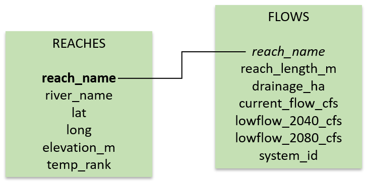

# Database Creation

This database is sourced from the open-source data provided by DeBano et al., 2016, which I accessed through Dryad. This data was collected to better understand the influences of climate change and agriculture on aquatic habitat in the Umatilla Sub-Basin. I used a relational database to house my data:

```{r fig1, echo = FALSE, eval = TRUE}

```


The database has 2 tables: *reaches* and *flows*. The *reaches* table contains information on the individual reaches with temperature data available, including what river the reach belongs to, the GPS location of the reach, the elevation, and the temperature. The *flows* table contains information on individual reaches that I have information on flows for, including reach length, upstream drainage area, the current flow rate, the predicted flow rates for years 2040 and 2080, and the land use setting. Primary keys are shown in italics and foreign keys are shown in bold. 

I created a database in RSQLite to house the data.

```{r database1, eval = TRUE}
library(DBI)
library(tidyverse)
UmatillaSubBasin_db <-dbConnect(RSQLite::SQLite(), "../UmatillaSubBasin.db")
```

## Reaches

First, I created the reaches table with reach_name as the primary key.
```{r database2, eval = FALSE}
dbExecute(UmatillaSubBasin_db, "CREATE TABLE reaches (
          reach_name,
          river_name,
          lat,
          long,
          elevation_m,
          temp_rank
          PRIMARY KEY (reach_name)
          );")
```

Then, I loaded the reaches data from a csv into the reaches table.

```{r database3, eval = FALSE}
reaches <- read.csv("../data/reaches.csv", 
                    stringsAsFactors = FALSE)
names(reaches)

## [1] "reach_name"  "river_name"  "lat"         "long"        "elevation_m"
## [6] "temp_rank"

names(reaches)[1]<- "reach_name"
```

Next, I imported the data into the table and ran a query to make sure it was reading correctly.

```{r database4, eval = FALSE}
dbWriteTable(UmatillaSubBasin_db, "reaches", reaches, append = TRUE)

```

```{r database7, eval = TRUE}

reaches <- dbGetQuery(UmatillaSubBasin_db, "SELECT * FROM reaches;")
reaches
dbGetQuery(UmatillaSubBasin_db, "SELECT * FROM reaches LIMIT 10;")
```

## Flows

I created the flows table with reach_name as the foreign key.

```{r database5, eval = FALSE}
dbExecute(UmatillaSubBasin_db, "CREATE TABLE flows (
          reach_name,
          reach_length_m,
          drainage_ha,
          currentflow_cfs,
          lowflow_2040_cfs,
          lowflow_2080_cfs,
          system_id,
          FOREIGN KEY(reach_name) REFERENCES reaches(reach_name)
          );")
```

Next, I loaded the flows data from a csv into the flows table.

```{r}
flows <- read.csv("../data/flows.csv", 
                    stringsAsFactors = FALSE)
```

Then, I imported the data into the table. This table only stores information on the reaches where temperature was sampled. I also ran a query to check that it was working properly.

```{r database6, eval = FALSE}
dbWriteTable(UmatillaSubBasin_db, "flows", flows, append = TRUE)

flows <- dbGetQuery(UmatillaSubBasin_db, "SELECT * FROM flows;")

dbGetQuery(UmatillaSubBasin_db, "SELECT * FROM flows LIMIT 10;")
###    reach_name          reach_length_m drainage_ha    currentflow_cfs lowflow_2040_cfs
# 1     Bachelor Canyon        1370.08      778.40            1.63             1.49
# 2           Bassey Cr        8754.77     1559.67            2.54             2.29
# 3           Bear (UM)        4651.86     1159.99            2.10             1.91
# 4     Bear Cr (McKay)        1473.40      537.70            0.98             0.90
# 5    Bear Cr1 (Birch)        5253.53    10949.60           18.75            17.08
# 6  Bear Cr1 (Meacham)        1816.61     3255.40            6.50             5.95
# 7    Bear Cr2 (Birch)       17442.18     3343.84            6.20             5.63
# 8  Bear Cr2 (Meacham)        4066.95     1735.04            3.25             2.97
# 9          Beaver Cr1        1889.15     2033.90            4.27             3.91
#10         Beaver Cr3         238.66     1211.95            1.79             1.64

#########lowflow_2080_cfs 
# 1              1.41
# 2              2.14
# 3              1.76
# 4              0.86
# 5             16.23
# 6              5.52
# 7              5.39
# 8              2.75
# 9              3.67
# 10             1.54
```

